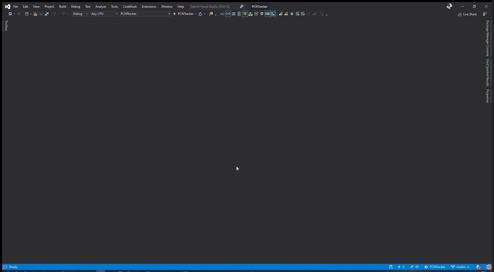
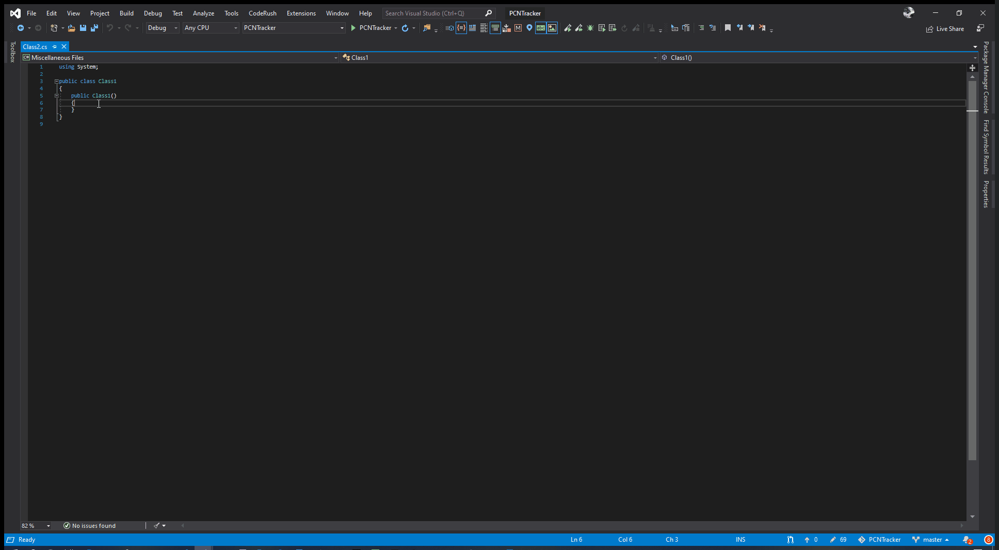

# Visual Studio Code Snippets

A collection of useful snippets

Here will be a collection of what, at least what I think/hope, are useful snippets to use inside of Visual Studio

## Installing a snippet

- Clone, Fork or Download this repo from [https://github.com/cmjchrisjones/VisualStudioSnippets](https://github.com/cmjchrisjones/VisualStudioSnippets)
- In Visual Studio, select `Tools -> Code Snippets Manager -> Import`
- Navigate to the root of where you downloaded the repository
- Look inside the snippets folder
- Select the Snippet(s) you want to install
- Click Open

## Snippets Available

Below are a list of the snippets contained

|FileName|Snippet Shortcut|Purpose|Screenshot|
|:-:|:-:|:-:|:-:|
|ArrangeActAssert.snippet|aaa|Save time writing Arrange, Act and Assert comments in unit tests, just do `aaa` and hit `tab` and the comments will appear||

## To Contribute

Pull Requests are more than welcome to share what you think are useful snippets. When raising a PR please ensure to update this document in the table above which describes the shortcut, filename, purpose and a short screen capture (recorded using the [ScreenToGif](https://www.screentogif.com/) software, places in the docs/images folder)
